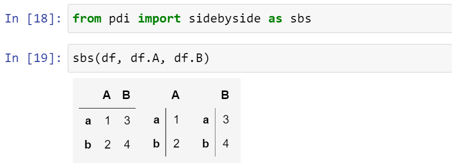

# pandas-illustrated

[](https://pypi.python.org/pypi/pandas-illustrated)
[](https://pypi.org/project/pandas-illustrated/)


[](https://github.com/psf/black)
[](https://pypi.org/project/pandas-illustrated/)

This repo contains code for a number of helper functions mentioned in the [Pandas Illustrated](https://betterprogramming.pub/pandas-illustrated-the-definitive-visual-guide-to-pandas-c31fa921a43?sk=50184a8a8b46ffca16664f6529741abc) guide.

## Installation: 

    pip install pandas-illustrated

## Contents

Basic operations:
- find
- findall
- insert
- drop
- move
- join

Visualization improvements:
- patch_series_repr
- unpatch_series_repr
- sidebyside
- sbs

MultiIndex helpers:
- patch_mi_co
- from_dict
- from_kw

Locking columns order:
- locked
- lock
- vis_lock
- vis_patch
- vis_unpatch
- from_product

Level manipulations:
- get_level
- set_level
- move_level
- insert_level
- drop_level
- swap_levels
- join_levels
- split_level
- rename_level


## Usage

### find and findall

By default `find(series, value)` looks for the first occurrence of the given *value* in a *series* and returns the corresponsing index label.

```python
>>> import pandas as pd
>>> import pdi

>>> s = pd.Series([4, 2, 4, 6], index=['cat', 'penguin', 'dog', 'butterfly'])

>>> pdi.find(s, 2)
'penguin' 

>>> pdi.find(s, 4)
'cat' 
```

When the value is not found raises a `ValueError`.

`findall(series, value)` returns a (possibly empty) index of all matching occurrences:

```python
>>> pdi.findall(s, 4)
Index(['cat', 'dog'], dtype='object')
```

With `pos=True` keyword argument `find()` and `findall()` return the positional index instead:

```python
>>> pdi.find(s, 2, pos=True)
1 

>>> pdi.find(s, 4, pos=True)
0
```
There is a number of ways to find index label for a given value. The most efficient of them are:

```python
— s.index[s.tolist().index(x)]       # faster for Series with less than 1000 elements
— s.index[np.where(s == x)[0][0]]    # faster for Series with over 1000 elements  
```


`find()` chooses optimal implementation depending on the series size; `findall()` always uses the `where` implementation.

### Improving Series Representation

Run `pdi.patch_series_repr()` to make Series look better:


If you want to display several Series from one cell, call `display(s)` for each.

### Displaying several Pandas objects side vy side

To display several dataframes, series or indices side by side run `pdi.sidebyside(s1, s2, ...)`



## Testing

Run `pytest` in the project root.
